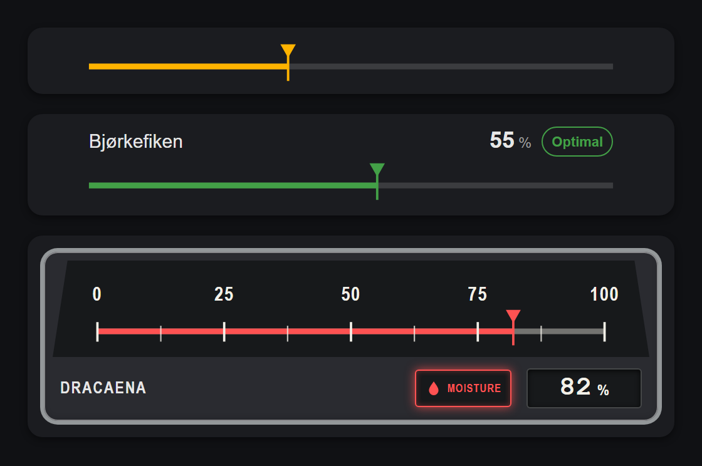

# Horizontal Gauge Card

A responsive, theme-aware horizontal gauge for any numeric sensor in Home Assistant 2026.6 and newer. Its wide linear scale and high-contrast instrument face are inspired by the classic Volvo Amazon speedometer. It supports graphical configuration, dashboard actions, Sections sizing, and offline operation after installation.



## Installation

### HACS custom repository

1. Open HACS and select the three-dot menu.
2. Select **Custom repositories**.
3. Add `https://github.com/bardagi/ha-horizontal-gauge` with category **Dashboard**.
4. Install **Horizontal Gauge Card** and refresh Home Assistant.

HACS registers `horizontal-gauge-card.js` automatically.

### Manual installation

1. Download `horizontal-gauge-card.js` from the latest GitHub release.
2. Copy it to `<config>/www/horizontal-gauge-card.js`.
3. Add `/local/horizontal-gauge-card.js` as a JavaScript module under **Settings → Dashboards → Resources**.
4. Refresh the browser.

The release bundle includes Lit and uses Home Assistant's native card-action event. It makes no runtime CDN requests.

## Configuration

The card is available in Home Assistant's card picker and visual editor, and self-suggests for any numeric `sensor.*` entity.

> Upgrading from Moisture Gauge Card? Update `type: custom:moisture-gauge-card` to `type: custom:horizontal-gauge-card` — the old type is no longer registered. If you manage dashboard resources manually or in YAML, also replace `moisture-gauge-card.js` with `horizontal-gauge-card.js` in both the installed filename and resource URL. HACS updates storage-managed resource URLs automatically.

### Basic

```yaml
type: custom:horizontal-gauge-card
entity: sensor.living_room_humidity
name: Living Room Humidity
```

### All options

```yaml
type: custom:horizontal-gauge-card
entity: sensor.living_room_humidity
layout: simple
name: Living Room Humidity
unit: "%"
min: 0
max: 100
optimal:
  min: 40
  max: 70
buffer: 5
lamp:
  icon: mdi:water-percent
  label: Comfortable
  alert_label: Out of range
tap_action:
  action: more-info
hold_action:
  action: none
double_tap_action:
  action: none
```

| Option              | Required | Default                | Description                                                     |
| ------------------- | -------- | ---------------------- | --------------------------------------------------------------- |
| `entity`            | Yes      | —                      | Numeric sensor to display.                                      |
| `layout`            | No       | `simple`               | `compact`, `simple`, or `volvo`.                                |
| `name`              | No       | Entity name            | Card title.                                                     |
| `unit`              | No       | Entity unit, then none | Display unit. Set `""` to hide it.                              |
| `min`               | No       | `0`                    | Gauge minimum.                                                  |
| `max`               | No       | `100`                  | Gauge maximum. Must exceed `min`.                               |
| `optimal.min`       | No       | `40`                   | Inclusive lower bound of the optimal range.                     |
| `optimal.max`       | No       | `70`                   | Inclusive upper bound of the optimal range.                     |
| `buffer`            | No       | `5`                    | Warning-zone width in the sensor's unit.                        |
| `lamp.icon`         | No       | `mdi:circle`           | Volvo layout only: icon shown on the status lamp.               |
| `lamp.label`        | No       | `""` (none)            | Volvo layout only: label shown while the value is in range.     |
| `lamp.alert_label`  | No       | `""` (none)            | Volvo layout only: label shown while the value is out of range. |
| `tap_action`        | No       | `more-info`            | Action performed on tap or Enter/Space.                         |
| `hold_action`       | No       | `none`                 | Action performed after holding for 500 ms.                      |
| `double_tap_action` | No       | `none`                 | Action performed on double tap.                                 |

Values inside `optimal` are green. Values up to `buffer` below or above that range are yellow. Values outside the buffered range are red. Thresholds use the sensor's raw unit, even when `min` and `max` are customized.

Values outside `min` and `max` are displayed unchanged while the horizontal marker is clamped to the nearest endpoint. Missing, unknown, unavailable, malformed, and infinite states display a neutral gauge and `—`; they are never interpreted as zero.

### Layouts

- `compact` shows only the theme-aware horizontal line and zone-colored position arrow.
- `simple` adds the entity name, formatted value, and an explicit `Optimal`, `Below optimal`, `Above optimal`, or `Unavailable` status.
- `volvo` keeps the full vintage instrument styling. Its status lamp shows a configurable `lamp.icon` and swaps between `lamp.label` and `lamp.alert_label` as the value moves in and out of the optimal range — dim while optimal or unavailable, amber in the warning buffer, and red in the critical zone.

Compact, Simple, and Volvo report one, two, and three suggested dashboard rows respectively. All layouts support the same tap, hold, and double-tap actions.

## Multiple gauges

```yaml
type: grid
columns: 3
cards:
  - type: custom:horizontal-gauge-card
    entity: sensor.living_room_humidity
    name: Humidity
    optimal:
      min: 40
      max: 60

  - type: custom:horizontal-gauge-card
    entity: sensor.water_tank_level
    name: Tank Level
    optimal:
      min: 30
      max: 90

  - type: custom:horizontal-gauge-card
    entity: sensor.backup_battery
    name: Backup Battery
    optimal:
      min: 50
      max: 100
```

The card works for anything that reports a numeric state — humidity, tank or reservoir levels, battery percentage, CO2, soil moisture, and more. Set `optimal` and `buffer` to whatever range makes sense for the sensor.

## History

Combine the gauge with Home Assistant's history graph card:

```yaml
type: vertical-stack
cards:
  - type: custom:horizontal-gauge-card
    entity: sensor.living_room_humidity
    name: Living Room Humidity

  - type: history-graph
    title: Humidity history
    hours_to_show: 24
    entities:
      - sensor.living_room_humidity
```

## Themes and sizing

The card uses Home Assistant's `--primary-text-color`, `--secondary-text-color`, `--divider-color`, `--success-color`, `--warning-color`, and `--error-color` theme variables.

It also exposes:

- `--gauge-width`, default `640px`
- `--gauge-height`, default `auto`
- `--gauge-face-color`, default `#17191b`
- `--gauge-panel-color`, default theme secondary background
- `--gauge-bezel-color`, default muted silver
- `--gauge-dial-color`, default `#f2f0e8`
- `--gauge-readout-color`, default `#17191b`

These custom properties can be supplied globally by a Home Assistant theme. The gauge automatically shrinks to fit narrow cards.

## Development

Requires Node.js 24 or newer.

```bash
npm install
npm run check
```

Source lives in `src/`; the HACS and release artifact is `dist/horizontal-gauge-card.js`. The complete check runs formatting, linting, type checking, tests, a production build, and a remote-import inspection.

Note: `images/screenshot.png` still shows the card under its previous "Moisture Gauge Card" branding and has not been regenerated as part of this rename.

### Releasing

Versioning follows [semver](https://semver.org) and the `package.json` `version` field is the source of truth; it's baked into the built bundle's banner comment and must match the git tag.

```bash
npm version patch   # or minor / major
git push --follow-tags
```

`npm version` bumps `package.json`/`package-lock.json`, rebuilds `dist/horizontal-gauge-card.js` so its banner matches, and commits both along with a `vX.Y.Z` tag. Pushing the tag triggers the [release workflow](.github/workflows/release.yml), which refuses to publish if the tag and `package.json` version disagree, then attaches the built bundle to a GitHub Release.

## License

[MIT](LICENSE)
